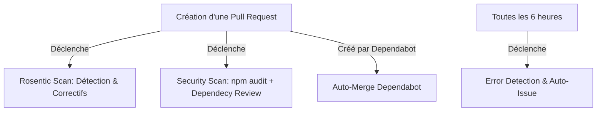

# Guide d'Automatisation DevSecOps & QA Autonome 🛡️🤖
## Comprendre et Reproduire le Système de Sécurité et de Correction Automatique

> Ce guide détaille l'infrastructure d'intégration continue (CI) et de sécurité mise en place sur **BisoMapTech** (TechMapCongo). Il sert de référence pour comprendre le rôle de chaque composant et fournit une procédure pas à pas pour reproduire exactement ce système autonome sur n'importe quel autre projet.

---

## 📋 Table des Matières
1. [🧠 Comprendre l'Architecture Actuelle](#1-comprendre-larchitecture-actuelle)
2. [🔍 Analyse Détaillée des Workflows](#2-analyse-détaillée-des-workflows)
3. [🚀 Guide de Reproduction sur un Nouveau Projet](#3-guide-de-reproduction-sur-un-nouveau-projet)
4. [⚙️ Configuration des Autorisations GitHub obligatoires](#4-configuration-des-autorisations-github-obligatoires)

---

## 🧠 1. Comprendre l'Architecture Actuelle

Le système repose sur **GitHub Actions**, une plateforme d'intégration et de livraison continues (CI/CD) intégrée à GitHub. Quatre pipelines autonomes surveillent en permanence le projet :



---

## 🔍 2. Analyse Détaillée des Workflows

### 🛡️ A. Rosentic Scan (`rosentic.yml`)
* **But** : Scanner le code statique à la recherche de bugs logiques et de failles de sécurité directement dans les PRs, avec possibilité d'aide à la correction automatique.
* **Fonctionnement** :
  - Il s'exécute dès qu'une Pull Request cible la branche `main`.
  - Il configure des autorisations en écriture pour pouvoir commenter ou modifier la PR si des corrections de bugs automatiques sont prêtes.

```yaml
name: Rosentic Scan
on:
  pull_request:
    branches: [main]

jobs:
  rosentic:
    runs-on: ubuntu-latest
    permissions:
      contents: read
      pull-requests: write # Permet à Rosentic d'écrire des commentaires de revue
    steps:
      - uses: actions/checkout@v4
        with:
          fetch-depth: 0 # Récupère tout l'historique pour l'analyse des modifications
      - uses: Rosentic/rosentic-action@v1.1.0
```

### 🔒 B. Security Scan (`security.yml`)
* **But** : S'assurer que le projet n'importe pas de packages tiers vulnérables.
* **Fonctionnement** :
  - S'exécute sur chaque PR et de manière hebdomadaire (tous les lundis à 3h00 UTC).
  - Réalise un `npm audit` (bloquant si vulnérabilité modérée ou supérieure).
  - Évalue les nouvelles dépendances ajoutées via l'action officielle de GitHub `dependency-review-action`.

```yaml
name: Security Scan
on:
  pull_request:
  schedule:
    - cron: "0 3 * * 1" # Tous les lundis à 03:00

jobs:
  security:
    runs-on: ubuntu-latest
    steps:
      - name: Checkout repository
        uses: actions/checkout@v4
      - name: Setup Node.js
        uses: actions/setup-node@v4
        with:
          node-version: 20
      - name: Install dependencies
        run: npm install
      - name: Run npm audit
        run: npm audit --audit-level=moderate
      - name: Run dependency review
        uses: actions/dependency-review-action@v4
```

### 🚨 C. Error Detection & Auto Issue (`error-report.yml`)
* **But** : Détecter les plantages de production de façon asynchrone et générer automatiquement des tickets de correction (Issues).
* **Fonctionnement** :
  - S'exécute toutes les 6 heures ou manuellement via l'onglet "Actions" (`workflow_dispatch`).
  - Scanne/simule l'état des services. Si une anomalie est détectée, il utilise le bot `imjohnbo/issue-bot` pour ouvrir une issue GitHub documentée et étiquetée.

```yaml
name: Error Detection & Auto Issue
on:
  workflow_dispatch:
  schedule:
    - cron: "0 */6 * * *" # Toutes les 6 heures

jobs:
  detect-errors:
    runs-on: ubuntu-latest
    steps:
      - name: Checkout repository
        uses: actions/checkout@v4
      - name: Simulate production log scan
        run: |
          echo "Checking logs..."
          echo "ERROR_FOUND=true" >> $GITHUB_ENV
      - name: Create GitHub Issue if error found
        if: env.ERROR_FOUND == 'true'
        uses: imjohnbo/issue-bot@v3
        with:
          title: "[AUTO] Production error detected"
          body: |
            An automatic scan detected a potential production issue.
            Please investigate the logs and affected services.
            Triggered automatically by GitHub Actions.
          labels: "bug,auto-detected,jules"
        env:
          GITHUB_TOKEN: ${{ secrets.GITHUB_TOKEN }}
```

### 🤖 D. Auto Merge Dependabot (`auto-merge.yml`)
* **But** : Fusionner automatiquement les mises à jour mineures et correctives de sécurité proposées par Dependabot une fois les tests passés.
* **Fonctionnement** :
  - Filtre l'auteur de la PR (`dependabot[bot]`).
  - Active l'auto-merge via l'API GitHub pour éviter l'intervention humaine sur les montées de versions mineures.

```yaml
name: Auto Merge Dependabot
on:
  pull_request:

jobs:
  automerge:
    runs-on: ubuntu-latest
    if: github.actor == 'dependabot[bot]'
    steps:
      - name: Enable auto-merge for Dependabot PRs
        uses: peter-evans/enable-pull-request-automerge@v3
        with:
          token: ${{ secrets.GITHUB_TOKEN }}
          pull-request-number: ${{ github.event.pull_request.number }}
```

---

## 🚀 3. Guide de Reproduction sur un Nouveau Projet

Suivez ces étapes simples pour déployer ce système sur un autre dépôt :

### Étape 1 : Créer l'architecture des dossiers
Dans votre nouveau projet, à la racine, créez le dossier contenant les définitions de workflows :
```bash
mkdir -p .github/workflows
```

### Étape 2 : Créer et copier les fichiers de configuration
Créez les 4 fichiers correspondants dans `.github/workflows/` :
1. `rosentic.yml`
2. `security.yml`
3. `error-report.yml`
4. `auto-merge.yml`

*Copiez-y le contenu YAML présenté dans la section 2 en ajustant si besoin la version de Node.js ou les labels des tickets.*

### Étape 3 (Optionnel mais recommandé) : Activer Dependabot
Pour que le workflow `auto-merge.yml` fonctionne, vous devez configurer Dependabot en créant un fichier `.github/dependabot.yml` à la racine :
```yaml
version: 2
updates:
  - package-ecosystem: "npm" # ou pip, cargo, etc.
    directory: "/"
    schedule:
      interval: "weekly"
```

---

## ⚙️ 4. Configuration des Autorisations GitHub obligatoires

Pour que GitHub Actions ait le droit de créer des issues, d'approuver des PRs ou d'exécuter des fusions automatiques, configurez les options suivantes sur votre dépôt GitHub :

1. Accédez à votre dépôt sur **GitHub** > **Settings** (Paramètres).
2. Dans le menu de gauche, cliquez sur **Actions** > **General**.
3. Faites défiler jusqu'à la section **Workflow permissions** :
   - Cochez **"Read and write permissions"** (nécessaire pour la création d'issues et l'écriture de commentaires Rosentic).
   - Cochez la case **"Allow GitHub Actions to create and approve pull requests"** (nécessaire pour l'auto-merge de Dependabot).
4. Cliquez sur **Save**.

---

### 🌟 Avantages de cette stack sur vos futurs projets :
- **Zéro maintenance manuelle** : Les vulnérabilités de packages sont signalées et corrigées automatiquement.
- **Fiabilité à long terme** : Le scan automatique périodique (toutes les 6h et chaque semaine) garantit que même un projet "endormi" reste surveillé.
- **Rapports centralisés** : Plus besoin de surveiller des consoles d'administration externes, les anomalies de production se transforment immédiatement en tickets exploitables sur GitHub.
