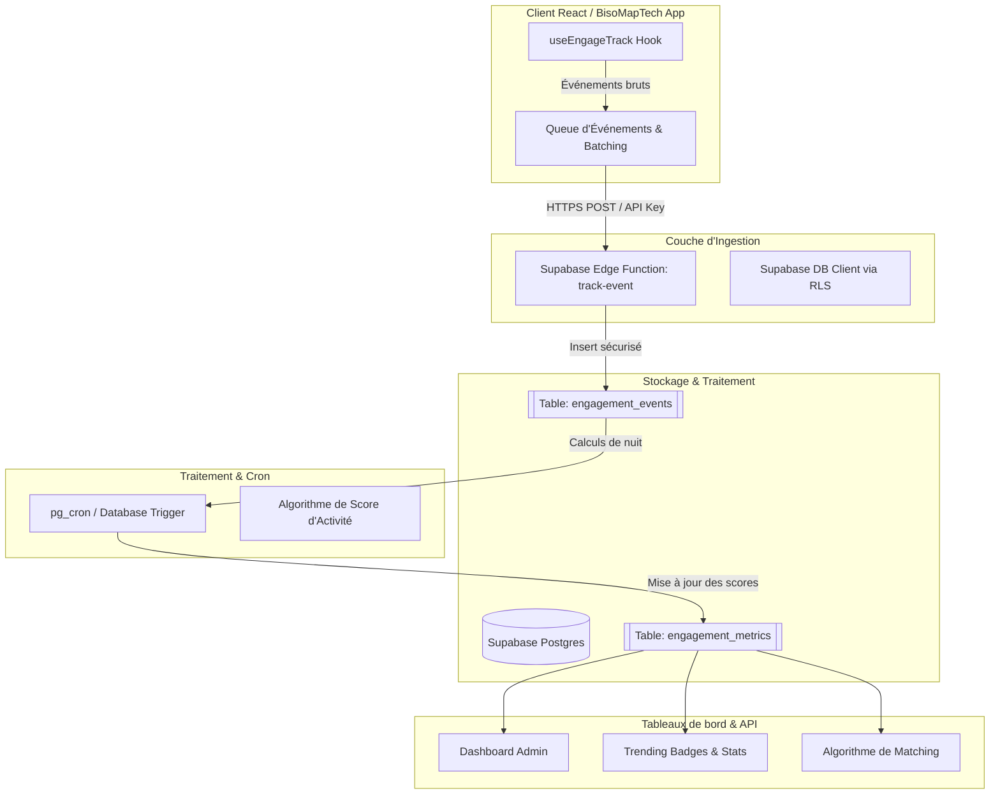

# Le Pipeline EngageTrack 🚀
## Système de Suivi d’Engagement & d'Analytique pour BisoMapTech

> **EngageTrack** est l'infrastructure de collecte de données d'activité et de calcul de score d'engagement de **BisoMapTech**. Son objectif principal est de mesurer la vitalité de l'écosystème tech congolais, d'identifier les profils/startups à fort impact, et d'optimiser l'expérience utilisateur grâce à des métriques réelles (vues de profils, clics sur la carte, messages échangés, technos recherchées).

---

## 🗺️ Vision Globale & Objectifs

Pour que TechMapCongo devienne l'infrastructure de confiance de l'économie numérique au Congo, la plateforme a besoin de mesurer précisément les interactions. EngageTrack répond à 3 grands défis :
1. **Valorisation des talents** : Mesurer l'intérêt pour chaque développeur (ex. "Votre profil a été vu 15 fois cette semaine par des recruteurs").
2. **Cartographie dynamique** : Identifier les incubateurs, startups et villes les plus actifs ("hotspots").
3. **Analytique de l'écosystème** : Fournir des statistiques réelles et anonymisées sur les langages de programmation les plus recherchés et adoptés en RDC et RC.



---

## 🛠️ Architecture Technique

### 1. Ingestion Client-side (`useEngageTrack`)
Un hook React léger encapsulé pour éviter de ralentir le rendu de la carte Leaflet et les transitions de pages. Les événements sont mis en mémoire tampon (buffering) et envoyés en lot (batch) toutes les 5 secondes ou lors du déchargement de la page (`beforeunload`).

### 2. Couche Réseau
Les événements sont poussés vers une Edge Function dédiée `/functions/track-event` ou insérés directement dans une table Supabase avec des règles de sécurité (RLS) strictes qui autorisent uniquement les insertions (`INSERT-only`).

### 3. Couche Base de données & RLS
Toutes les données brutes sont conservées dans une table partitionnée pour de hautes performances, puis agrégées de manière asynchrone pour ne pas surcharger la base transactionnelle.

---

## 📊 Modèle de Données (PostgreSQL Schema)

Voici la structure recommandée pour stocker les interactions et les métriques d'engagement.

```sql
-- Extension pour la gestion des UUID si non installée
CREATE EXTENSION IF NOT EXISTS "uuid-ossp";

-- 1. Table des événements d'engagement bruts (Telemetry)
CREATE TABLE public.engagement_events (
    id UUID PRIMARY KEY DEFAULT uuid_generate_v4(),
    session_id UUID NOT NULL,
    user_id UUID REFERENCES auth.users(id) ON DELETE SET NULL, -- NULL si visiteur anonyme
    event_type VARCHAR(50) NOT NULL, -- 'map_click', 'profile_view', 'github_click', 'message_sent', 'search'
    target_id VARCHAR(100), -- ID du profil visualisé, de la place cliquée, du projet, etc.
    payload JSONB DEFAULT '{}'::jsonb, -- Données additionnelles (ex: {tech: 'React', zoom_level: 8})
    page_path VARCHAR(255) NOT NULL,
    created_at TIMESTAMP WITH TIME ZONE DEFAULT timezone('utc'::text, now()) NOT NULL
);

-- Indexation pour optimiser les requêtes analytiques frequentes
CREATE INDEX idx_engage_event_type ON public.engagement_events(event_type);
CREATE INDEX idx_engage_target_id ON public.engagement_events(target_id);
CREATE INDEX idx_engage_created_at ON public.engagement_events(created_at);

-- 2. Table des scores d'engagement calculés (Aggregations)
CREATE TABLE public.profile_engagement_metrics (
    profile_id UUID PRIMARY KEY REFERENCES public.profiles(id) ON DELETE CASCADE,
    views_last_30_days INT DEFAULT 0,
    github_clicks_30_days INT DEFAULT 0,
    messages_received_30_days INT DEFAULT 0,
    engagement_score NUMERIC(5,2) DEFAULT 0.00, -- Score pondéré sur 100
    last_calculated_at TIMESTAMP WITH TIME ZONE DEFAULT timezone('utc'::text, now()) NOT NULL
);

-- Index pour le tri et le classement (Profiles les plus actifs, tendance)
CREATE INDEX idx_profile_score ON public.profile_engagement_metrics(engagement_score DESC);
```

### Règles RLS (Row Level Security)
```sql
ALTER TABLE public.engagement_events ENABLE ROW LEVEL SECURITY;

-- Autoriser n'importe quel visiteur (anonyme ou connecté) à insérer des événements
CREATE POLICY "Allow public inserts on engagement_events" 
ON public.engagement_events 
FOR INSERT 
TO anon, authenticated 
WITH CHECK (true);

-- Empêcher la lecture publique ou la mise à jour des logs bruts par le client
CREATE POLICY "Restrict read/write on engagement_events" 
ON public.engagement_events 
FOR SELECT, UPDATE, DELETE 
TO service_role;
```

---

## 📈 L'Algorithme de Score d'Activité (Engagement Score)

Afin d'éviter d'afficher des données d'engagement biaisées, le score d'engagement global est calculé quotidiennement à l'aide d'une pondération logarithmique et temporelle.

### Formule de Pondération :
$$\text{Score} = (W_v \times \text{Vues}) + (W_g \times \text{Clics GitHub}) + (W_m \times \text{Discussions})$$

| Métrique | Code Événement | Poids ($W$) | Explication |
| :--- | :--- | :--- | :--- |
| **Vue du profil** | `profile_view` | **1** | Visibilité passive |
| **Clic externe** | `github_click` | **5** | Intérêt marqué pour le portfolio / code |
| **Premier contact** | `message_sent` | **10** | Connexion professionnelle amorcée |

### Décroissance Temporelle (Time Decay)
Les actions récentes valent plus que les actions passées. Un facteur de décroissance exponentiel est appliqué :
$$\text{Valeur effective} = \text{Valeur} \times e^{-\lambda t}$$
*(Où $t$ est l'âge de l'action en jours et $\lambda = 0.05$ pour une demi-vie d'environ 14 jours).*

---

## 🚀 Plan d'Implémentation (Roadmap)

### 🧱 Phase 1 : Base & Ingestion Supabase (Sprint 1)
- [ ] Exécuter la migration SQL pour créer la table `engagement_events` et `profile_engagement_metrics`.
- [ ] Configurer les règles RLS et les index.
- [ ] Écrire la fonction d'agrégation SQL quotidien (`refresh_engagement_scores()`).

### 📦 Phase 2 : Hook SDK Client React (Sprint 2)
- [ ] Créer le service `src/lib/engage-track.ts` pour gérer le buffering des événements.
- [ ] Implémenter le hook `useEngageTrack` et l'intégrer aux composants clés :
  - `ProfileCard` & `ProfileDetailPage` (déclencher `profile_view`).
  - `LeafletMap` (déclencher `map_click` et `place_view`).
  - `MatchingPage` (déclencher `matching_reason_click`).
  - Clics sur les liens GitHub / LinkedIn.
- [ ] Gérer l'anonymat : générer un `session_id` persistant dans le `localStorage` pour les utilisateurs non connectés.

### 🤖 Phase 3 : Tâches planifiées (Crons) & Automatisation (Sprint 3)
- [ ] Activer `pg_cron` sur Supabase ou créer un webhook déclenché par une GitHub Action quotidienne.
- [ ] Mettre à jour automatiquement le profil utilisateur avec un badge "Tendance" ou "Très Actif" si son score d'engagement dépasse un certain centile (ex: Top 10%).

### 📊 Phase 4 : Restitution & Dashboards (Sprint 4)
- [ ] **Espace Utilisateur** : Ajouter un mini-graphique dans le profil d'édition affichant les visites reçues.
- [ ] **Page À Propos** : Utiliser la table d'événements pour afficher le nombre total d'interactions de la communauté en temps réel.
- [ ] **Dashboard Admin** : Créer un onglet "Télémesure & Activité" avec le volume d'événements par jour, les mots clés de recherche les plus fréquents et le taux d'interaction global.

---

## 🔒 Confidentialité & RGPD (Privacy by Design)

Pour respecter la vie privée des développeurs et utilisateurs de la plateforme :
1. **Pas de tracking IP/User-Agent** : Les adresses IP et informations sensibles ne sont pas enregistrées dans `engagement_events`.
2. **Anonymisation par défaut** : Si l'utilisateur n'est pas connecté, le champ `user_id` reste strictemment à `NULL`.
3. **Data Retention Policy** : Les événements bruts dans `engagement_events` sont purgés automatiquement après **90 jours**. Seules les métriques agrégées dans `profile_engagement_metrics` sont conservées à long terme.
4. **Option d'Opt-out** : Permettre aux utilisateurs de désactiver le tracking analytique de leur profil depuis les paramètres de leur compte.
