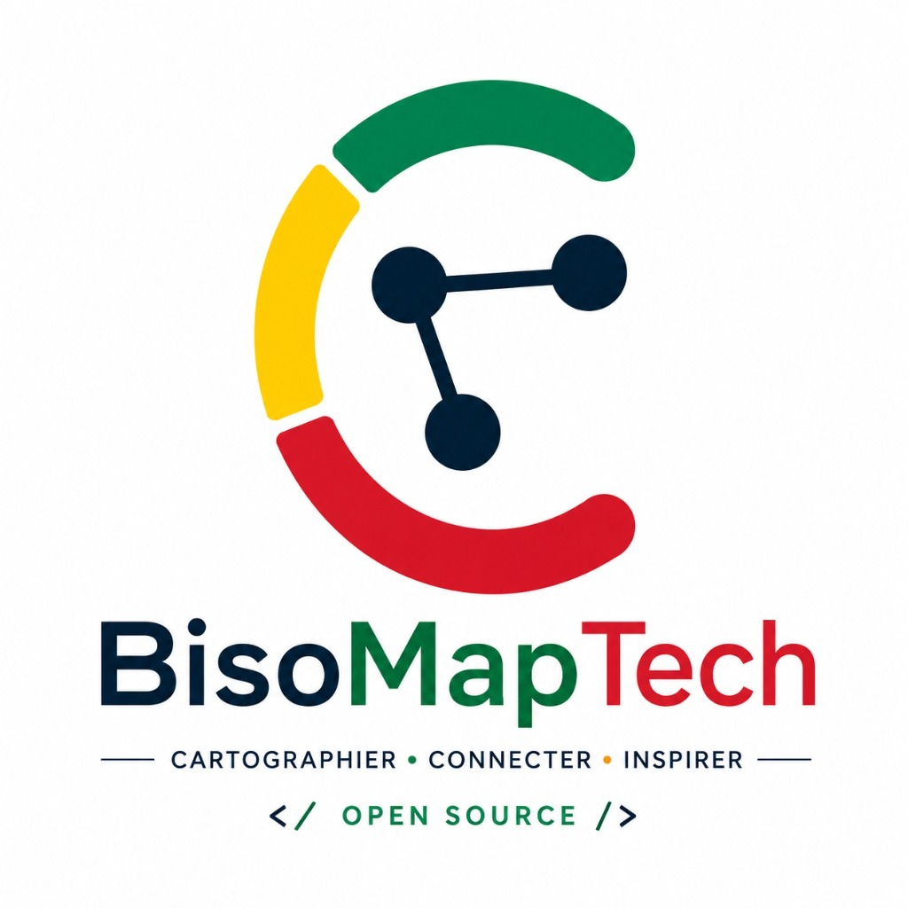
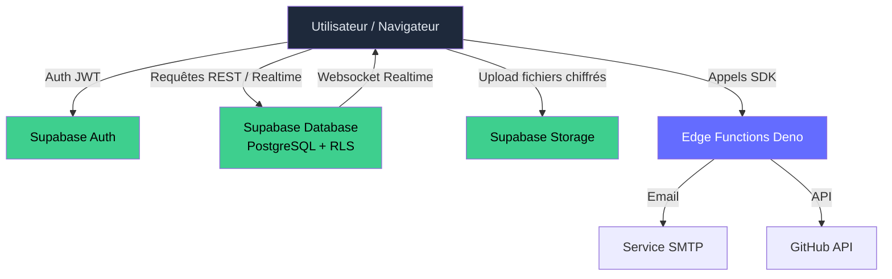
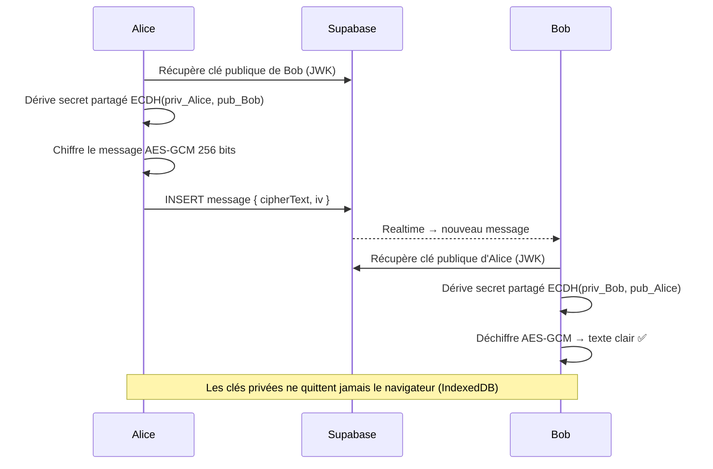
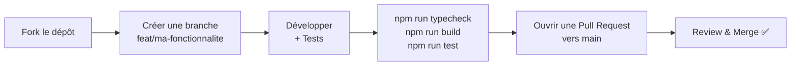

<div align="center">



<h1>BisoMapTech</h1>

<p><strong>La carte interactive de la communauté tech au Congo.</strong></p>

<p>
  <a href="https://vitejs.dev"></a>
  <a href="https://react.dev"></a>
  <a href="https://www.typescriptlang.org"></a>
  <a href="https://supabase.com"></a>
  <a href="https://tailwindcss.com"></a>
  
  
</p>

<p>
  <a href="#à-propos">À propos</a> ·
  <a href="#fonctionnalités">Fonctionnalités</a> ·
  <a href="#architecture">Architecture</a> ·
  <a href="#démarrage-rapide">Démarrage rapide</a> ·
  <a href="#contribution">Contribuer</a>
</p>

</div>

---

## À propos

**BisoMapTech** (*"biso"* = *"nous"* en Lingala) est une plateforme open source qui **cartographie et connecte** la communauté informatique de la République du Congo : développeurs, administrateurs systèmes & réseaux, professionnels de la cybersécurité, data engineers, DevOps, designers, formateurs et bien d'autres.

L'objectif est triple :

| 🗺️ Visibilité | 🤝 Connexion | 🌱 Représentation |
|---|---|---|
| Rendre lisible la richesse de l'écosystème tech congolais | Favoriser les rencontres, le mentorat et les collaborations | Montrer que la tech au Congo ne se limite pas à Brazzaville et inspirer les prochaines générations |

---

## Fonctionnalités

- 🗺️ **Carte interactive** (Leaflet) des contributeurs et des lieux tech du Congo
- 👤 **Profils détaillés** avec compétences, stack, projets et liens GitHub
- 🔐 **Authentification sécurisée** via Supabase Auth
- 🔍 **Recherche et filtres** par ville, métier, technologie, niveau d'expérience
- 💬 **Messagerie chiffrée de bout en bout** (E2EE — ECDH P-256 + AES-GCM 256)
- 🔔 **Notifications par e-mail** sur nouveaux messages (Edge Functions)
- 🏢 **Pages lieux** (coworking, écoles, communautés, entreprises…)
- ⚙️ **Synchronisation automatique** des dépôts GitHub d'un profil
- 🛡️ **Espace d'administration** pour la modération
- 📱 **Responsive** — optimisé mobile, mode clair / sombre

---

## Stack technique

| Domaine | Technologie |
| --- | --- |
| Build / Dev server | [Vite 7](https://vitejs.dev) |
| Framework UI | [React 19](https://react.dev) + TypeScript 5.9 |
| Routing | [React Router 6](https://reactrouter.com) |
| Styling | [Tailwind CSS 4](https://tailwindcss.com) + [shadcn/ui](https://ui.shadcn.com) (Radix UI) |
| State management | [Zustand](https://zustand-demo.pmnd.rs) |
| Formulaires | [React Hook Form](https://react-hook-form.com) + [Zod](https://zod.dev) |
| Carte | [Leaflet](https://leafletjs.com) + React Leaflet |
| Graphiques | [Recharts](https://recharts.org) |
| Backend | [Supabase](https://supabase.com) (PostgreSQL, Auth, Realtime, Storage, Edge Functions) |
| Tests | [Vitest](https://vitest.dev) |
| Déploiement | [Vercel](https://vercel.com) |

---

## Architecture

### Structure du projet

```
BisoMapTech/
├── public/                  # Assets statiques (logo, favicons)
├── src/
│   ├── components/          # Composants UI réutilisables
│   │   ├── filters/         #   Panneaux de filtres
│   │   ├── layout/          #   Navbar, Footer, Layout global
│   │   ├── map/             #   Couche Leaflet et marqueurs
│   │   ├── profile/         #   Formulaires et cartes de profil
│   │   └── ui/              #   shadcn/ui (Button, Input, Avatar…)
│   ├── pages/               # Pages applicatives routées
│   ├── hooks/               # Hooks React partagés
│   ├── lib/                 # Clients (Supabase, E2EE service) et utilitaires
│   ├── store/               # Stores Zustand (auth, filtres, unread…)
│   ├── types/               # Types TypeScript partagés
│   ├── App.tsx              # Configuration des routes
│   └── main.tsx             # Point d'entrée Vite
├── supabase/
│   ├── migrations/          # Schéma SQL versionné (Row Level Security)
│   └── functions/           # Edge Functions Deno
│       ├── send-message-notification/
│       └── sync-github-repos/
├── index.html
├── vite.config.ts
└── vercel.json
```

### Flux de données



### Chiffrement E2EE des messages



---

## Démarrage rapide

### Prérequis

- **Node.js 20+** (Vite 7 requiert Node ≥ 20.19)
- **npm** (ou pnpm / yarn / bun)
- Un projet **[Supabase](https://supabase.com)** (gratuit) pour la base de données et l'auth

### Installation

```bash
# 1. Cloner le dépôt
git clone https://github.com/KalelDAMBA/BisoMapTech.git
cd BisoMapTech

# 2. Installer les dépendances
npm install

# 3. Configurer les variables d'environnement
cp .env.example .env.local
# → Renseigner VITE_SUPABASE_URL et VITE_SUPABASE_ANON_KEY

# 4. Lancer le serveur de développement
npm run dev
```

L'application est disponible sur [http://localhost:5173](http://localhost:5173).

### Base de données Supabase

```bash
# Lier votre projet Supabase
supabase link --project-ref <votre_project_ref>

# Appliquer les migrations SQL
supabase db push

# Déployer les Edge Functions
supabase functions deploy send-message-notification
supabase functions deploy sync-github-repos
```

---

## Variables d'environnement

> ⚠️ Ne committez jamais vos clés. Le fichier `.env.local` est ignoré par Git.

| Variable | Obligatoire | Description |
| --- | :---: | --- |
| `VITE_SUPABASE_URL` | ✅ | URL du projet Supabase |
| `VITE_SUPABASE_ANON_KEY` | ✅ | Clé publique (anon) du projet Supabase |

---

## Scripts disponibles

| Commande | Description |
| --- | --- |
| `npm run dev` | Démarre le serveur de développement Vite (HMR) |
| `npm run build` | Vérifie les types TypeScript et génère la build de production |
| `npm run preview` | Sert localement la build de production |
| `npm run typecheck` | Vérification des types TypeScript uniquement |
| `npm run test` | Exécute la suite de tests Vitest |

---

## Contribution

Toutes les contributions sont les bienvenues, quel que soit votre profil dans l'informatique.

### Ajouter votre profil sur la carte

L'ajout de profil se fait directement depuis l'application :

1. Rendez-vous sur l'instance déployée (ou votre instance locale).
2. Créez un compte via la page **Connexion**.
3. Suivez le parcours d'**onboarding** pour renseigner votre métier, votre stack, votre ville et un point de localisation public.
4. Votre profil apparaît sur la carte une fois publié.

### Contribuer au code



1. **Forkez** le dépôt et créez une branche depuis `main` : `git checkout -b feat/ma-fonctionnalite`
2. Respectez la structure des dossiers et le style de code existant (TypeScript strict, composants fonctionnels, Tailwind utility-first)
3. Vérifiez la build et les tests avant de pousser :
   ```bash
   npm run typecheck
   npm run build
   npm run test
   ```
4. Ouvrez une **Pull Request** avec un titre clair au format [Conventional Commits](https://www.conventionalcommits.org/fr) (`feat:`, `fix:`, `docs:`, `refactor:`…)

### Domaines couverts

`Développement` · `Systèmes & Réseaux` · `Cybersécurité` · `Data / IA` · `DevOps / Cloud` · `Support / Helpdesk` · `Design / UX` · `Hardware / Électronique` · `Gestion de projet / Product` · `Enseignement / Formation` · `No-code / Automatisation`

---

## Sécurité & vie privée

Pour protéger les contributeurs, quelques règles s'appliquent à toute donnée de localisation publiée :

- ✅ Utilisez les coordonnées du **centre de votre ville** ou d'un **point de repère public** (mairie, place, monument, université)
- ❌ N'indiquez **jamais** votre adresse personnelle ni celle de votre employeur
- ❌ Ne réutilisez pas les coordonnées d'un autre contributeur

> 💡 [gps-coordinates.net](https://www.gps-coordinates.net) permet de trouver rapidement les coordonnées d'un point public.

### Coordonnées de référence — République du Congo

| Ville | Département | Latitude | Longitude |
| --- | --- | ---: | ---: |
| Brazzaville | Brazzaville | -4.2634 | 15.2429 |
| Pointe-Noire | Pointe-Noire | -4.7889 | 11.8653 |
| Dolisie | Niari | -4.1995 | 12.6667 |
| Nkayi | Bouenza | -4.1842 | 13.2883 |
| Madingou | Bouenza | -4.1550 | 13.5500 |
| Owando | Cuvette | -0.4819 | 15.9000 |
| Ouesso | Sangha | 1.6136 | 16.0517 |
| Impfondo | Likouala | 1.6186 | 18.0622 |

Pour signaler une vulnérabilité de sécurité, ouvrez une *issue* GitHub marquée `security`.

---

## Feuille de route

- [ ] Documentation publique de l'API (schéma RLS, tables, vues)
- [ ] Internationalisation (FR / EN / Lingala)
- [ ] Application mobile (PWA puis natif)
- [ ] Statistiques publiques de l'écosystème tech congolais
- [ ] Annuaire des entreprises et structures tech
- [ ] Programme de mentorat intégré
- [ ] Système de badges et de reconnaissance communautaire

Les suggestions sont les bienvenues : ouvrez une *issue* pour en discuter.

---

## Licence

Distribué sous licence **MIT**. Vous êtes libre d'utiliser, modifier et redistribuer ce projet en conservant la mention de copyright d'origine.

---

<div align="center">

Fait avec ❤️ par et pour la **communauté tech congolaise**

*BisoMapTech — Ensemble, on va plus loin.*

</div>
Test CI workflow